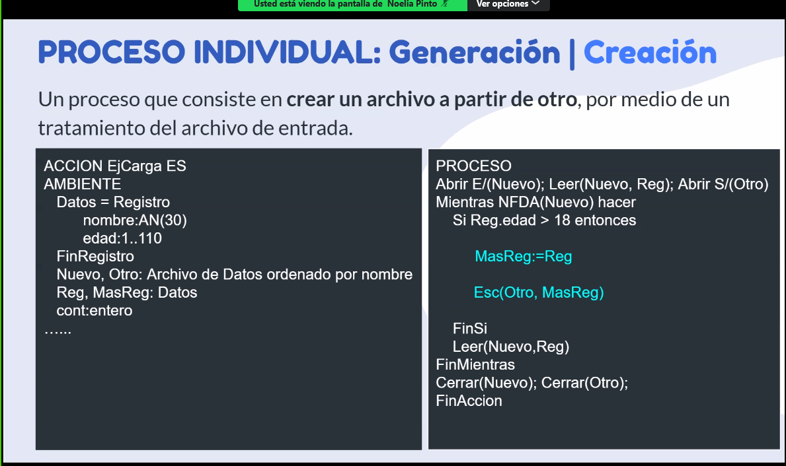
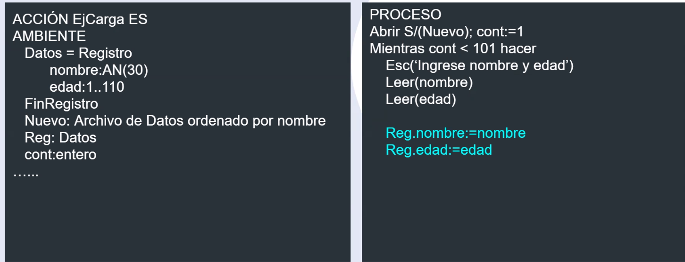
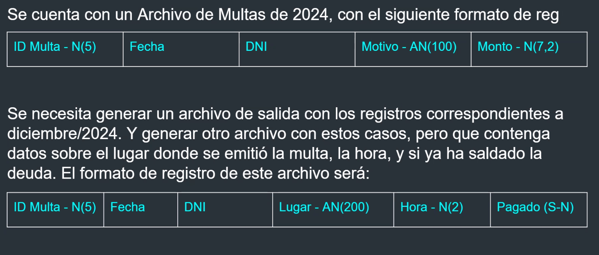
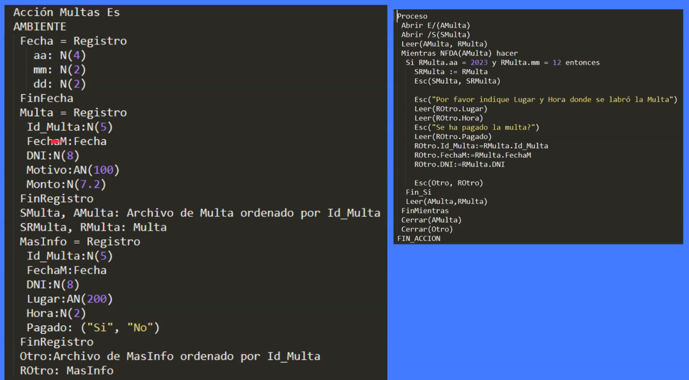
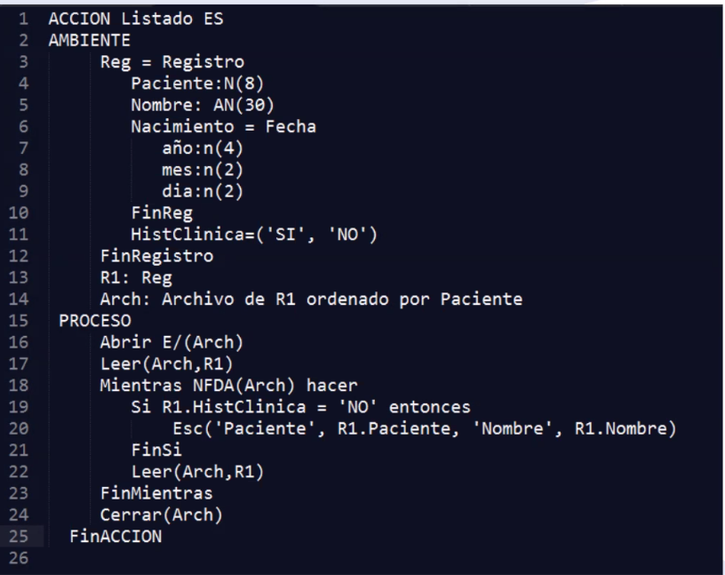
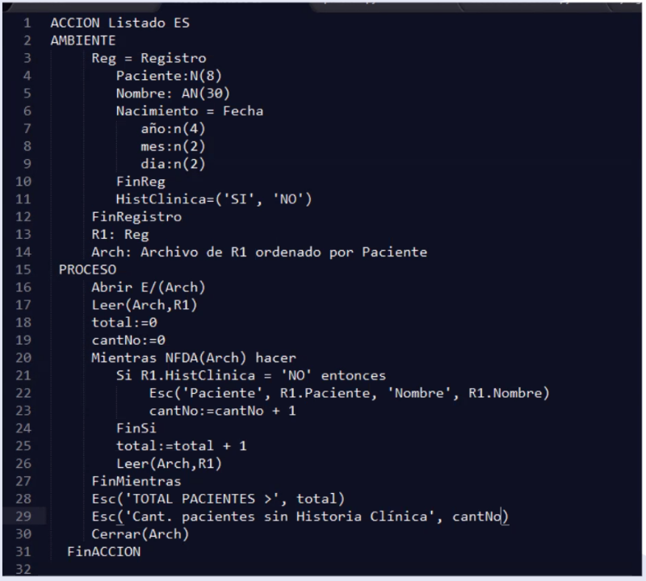

# Archivos
## Procesos:

Consistencia y Congruencia
La consistencia de archivos es la propiedad que verifica la validez del dato almacenado con su definicion en el ambiente

Rango o Conjunto:
Rango es N(13)
Conjunto Anio: 2022 .. 2030

congruencia FINA
Validacion entre datos en archivos distintos (Datos de un campo de un registro de un archivo, con datos de un campo de registro de otro archivo)
congruencia GRUESA
Validacion entre datos de un mismo registro
Por ejemplo 2021/23/34 un dato fecha, es consistente pero no congruente.

Tipos Procesos con archivos

Individuales o multiples
Archivo de entrada-> proceso-> Archivo de salida
Procesos Generico, emision, (estadisticos)

# archivo de generacion|creacion
Un proceso que consiste en crear un archivo a partir de otro, por medio de un tratamiento del archivo de entrada.

- creacion seria crear un archivo con una estructura totalmente diferente

# generacion|carga
Un proceso que consiste en la escrutura o grabacion de todos los registros que van a formar parte del archivo, en otro archivo u otra estructura de almacenamiento

Ejercicio

Solucion

Generacion|Listados

Un proceso que consisten listar informacion de registro de archivos dadas ciertas condiciones

Emision|Padrones

Un padron es un listado ordenado por algun campo, y al final se emite algun tipo de total

Hasta aca no hay forma de ordenar padrones y archivos
https://sites.google.com/view/desafiosarchivos/inicio?authuser=0
